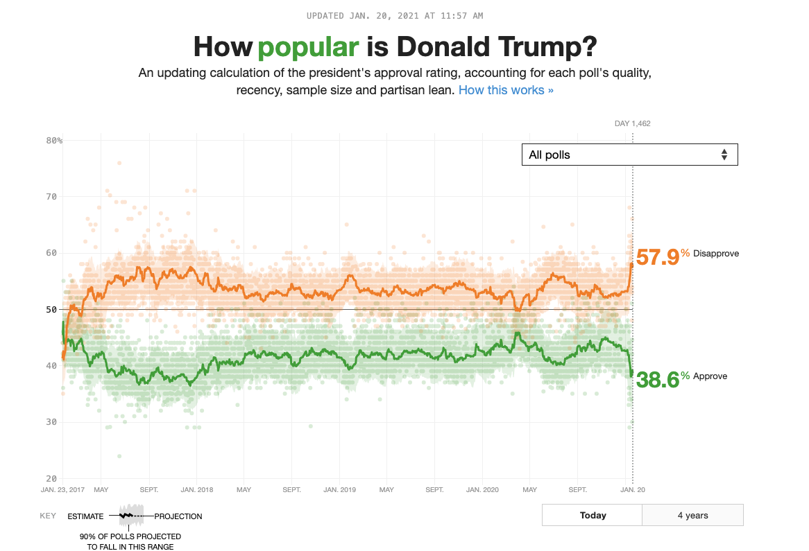

```{r setup, include=FALSE}
# Do not modify this chunk.
knitr::opts_chunk$set(echo = TRUE, warning = FALSE, message = FALSE)
```

```{r}
# Put all necessary libraries here
# I got you started!
# The first time you want to install the dsbox package; then you can comment it out.
# If you have not installed the devtools package, you will need to do so first
# install.packages("devtools")
# library(devtools)

devtools::install_github("tidyverse/dsbox")
library(dsbox)
library(tidyverse)
library(viridis)
```


## Due: Thursday, February 8th at 8:30am

## Goals of this lab

1. Practice coding to adhere to the Tidyverse Style Guide.
1. Practice creating and refining graphs with `ggplot2`.
1. Consider the strengths and weaknesses of various `geom`s and `aes`thetics for telling a data story.

## Notes:

* When creating your graphs, consider context (i.e. axis labels, title, ...)!
* If I provide partially completed code, I will put `eval = FALSE` in the chunk.  Make sure to change that to `eval = TRUE` once you have completed the code in the chunk.
* Be prepared to ask for help from me, Simon, and your classmates!  We scratched the surface of `ggplot2` in class.  But I encourage you to really dig in and make your graphs your own (i.e. don't rely on defaults).


## Problems


### Probem 1: Road traffic injuries in Edinburgh, Scotland 

The dataset can be found in the `dsbox` package, and is called `accidents`. It covers all recorded accidents in Edinburgh in 2018; compared to the dataset made available by the UK government, some of the variables were modified for the purposes of the package. You can find out more about the dataset by inspecting its documentation with `?accidents`. Recreate the following plot, and interpret the results.


```{r, out.width="100%", echo=FALSE}
knitr::include_graphics("../img/edi-accidents-1.png")
```

***

```{r}
accidents2 <- accidents %>%
  mutate(day_of_week = recode(day_of_week,
                              "Monday" = "Weekday",
                              "Tuesday" = "Weekday",
                              "Wednesday" = "Weekday",
                              "Thursday" = "Weekday",
                              "Friday" = "Weekday",
                              "Saturday" = "Weekend",
                              "Sunday" = "Weekend"
))
```


```{r}
ggplot(data = accidents2, mapping = aes(x = time, color = severity, fill = severity)) + 
  geom_density(alpha = 0.5) +
  theme_bw() +
  scale_fill_manual(values = c("Fatal" = "purple", "Serious" = "blue", "Slight" = "yellow")) +
  scale_color_manual(values = c("Fatal" = "purple", "Serious" = "blue", "Slight" = "yellow")) +
  facet_wrap(~day_of_week, ncol = 1) +
  labs(title = "Number of accidents throughout the day",
       subtitle = "By day of week and severity",
       x = "Time of day")
```

***

### Problem 2: One Dataset, Visualized ~~25~~ 5 Ways

Inspired by Nathan Yau's [One Dataset, Visualized 25 Ways](https://flowingdata.com/2017/01/24/one-dataset-visualized-25-ways/), I want you to create 5 visualizations of the same data. You can use the `mpg` dataset or another dataset of your choosing, including the `accidents` dataset above. Make sure you have the data manual open for this problem!  

a. Pick 3 - 4 variables you want to explore.  Provide their code names here.

***

manufacturer, cty, hwy, fl

***

b. Create 5 graphs.  A few things to consider:
    + Like Nathan's graphs, they don't all have to contain every one of your selected variables.
    + You can't use the same `geom` for all four graphs but you can use the same `geom` more than once.
    + Think carefully about color, the coordinate system, and scales.
    + Feel free to subset or wrangling the dataset if you want to but it isn't required.
    
***

```{r}
data(mpg)

ggplot(mpg, aes(x = cty, y = hwy)) + 
  geom_point(aes(color = manufacturer), alpha = 0.6) +
  theme_minimal() +
  theme(legend.position = "bottom") +
  labs(x = "City MPG", y = "Highway MPG", color = "Manufacturer",
       title = "City vs Highway MPG",
       subtitle = "Each point represents a car model")
```

```{r}
ggplot(data = mpg, mapping = aes(x = fl, y = hwy, fill = fl)) + 
  geom_boxplot() + 
  scale_fill_brewer(palette = "Paired") +
  theme_minimal() +
  theme(
    plot.title = element_text(hjust = 0.5),
    plot.subtitle = element_text(hjust = 0.5),
    axis.title.x = element_text(face = "bold"),
    axis.title.y = element_text(face = "bold"),
    legend.position = "bottom") +
  labs(
    title = "Distributions of Highway MPG",
    subtitle = "By Fuel Type",
    x = "Fuel Type", 
    y = "Highway MPG")
```

```{r}
mpg_avg <- mpg %>%
  group_by(manufacturer, fl) %>%
  summarise(avg_hwy = mean(hwy, na.rm = TRUE))

ggplot(mpg_avg, aes(x = reorder(manufacturer, avg_hwy), y = avg_hwy, fill = fl)) + 
  geom_bar(stat = "identity", position = position_dodge()) +
  facet_wrap(~fl, scales = "free_x") +
  theme_minimal() +
  theme(axis.text.x = element_text(angle = 65, hjust = 1),
        legend.position = "bottom") +
  labs(x = "Manufacturer", y = "Average Highway MPG", fill = "Fuel Type",
       title = "Average Highway MPG by Manufacturer and Fuel Type",
       subtitle = "Bars are colored by the type of fuel used")
```

```{r, fig.width=10}
ggplot(mpg, aes(x = manufacturer, y = hwy, fill = manufacturer)) + 
  geom_boxplot() +
  scale_fill_viridis_d() +
  theme_minimal() +
  theme(axis.text.x = element_text(angle = 45, hjust = 1),
        legend.position = "none") +
  labs(x = "Manufacturer", y = "Highway MPG", 
       title = "Highway Mileage by Manufacturer",
       subtitle = "Boxplot showing the spread of highway MPG across different car manufacturers")
```

```{r, fig.width=10}
ggplot(mpg, aes(x = manufacturer, y = cty, fill = manufacturer)) + 
  geom_boxplot() +
  scale_fill_viridis_d() +
  theme_minimal() +
  theme(axis.text.x = element_text(angle = 45, hjust = 1),
        legend.position = "none") +
  labs(x = "Manufacturer", y = "City MPG", 
       title = "City Mileage by Manufacturer",
       subtitle = "Boxplot showing the spread of city MPG across different car manufacturers")
```

***

c. Discuss the pros/cons of your graphs.  What useful information can be gleaned?  How do the different geoms and aesthetics impact the story?

***

Pros: I think I made good use of the scale_fill commands. As a result, I think my graphs have some nice colors on them. I did my best to make the labeling as clear as possible, so I would consider that a pro.

Cons: In the second graph, I wasn't really sure how to make the fuel type for fl go away. It's just the name of the variable so it doesn't make sense for there to be a boxplot. I think my third graph has a lot going on in it, and upon first glance I think it might be overwhelming for some people.

The different geoms and aesthetics, for the most part, really help to differentiate between car manufacturers. At least, that's what I was trying to go for. The second graph is the only one I didn't use the car manufacturer variable for, however, the colors make it easy to differentiate by fuel type. I think if a random were to look at these graphs, they would see that Volkswagen cars tend to have good city and highway mileage in comparison to cars from other manufacturers. I'd say that's what stood out to me in regards to the "story".

***


### Problem 3: Style This Code!

Take the following code and don't change its functionality but DO change its style.  Use the [Tidyverse Style Guide](https://style.tidyverse.org/)!

```{r}
animal_weights <- data.frame(
  weight = c(runif(3), NA),
  animal = c("cat", "mouse", "dog", "rat")
)

animal_median <- median(animal_weights$weight)
animal_mean <- mean(animal_weights$weight, 0, TRUE)
animal_var <- var(animal_weights$weight, NULL, TRUE)

ggplot(animal_weights, aes(x = animal, y = weight)) +
  geom_col() +
  scale_y_continuous() +
  labs(
    x = "Animal",
    y = "Weight",
    title = "Animal Weights"
  )
```


### Problem 4: Imitation is the Sincerest Form of Flattery

For this problem, I want you to try to recreate a FiveThirtyEight.com graphic.  Awesomely, they share their data with the world [here](https://data.fivethirtyeight.com/).  (Note: You don't need to recreate all their branding/background color scheme.)

a. Take a screenshot of the graph, upload it to the same folder on the server where you have saved your lab, and insert the file name below.  Then change the `eval = FALSE` to `eval = TRUE`.


```{r, out.width="100%", echo=FALSE, eval = TRUE}

```


b. Load the data and recreate the graph as best as you can.

***

```{r}
getwd()

approval_pollist <- read.csv("approval_pollist.csv")
```


```{r}
ggplot(approval_pollist) +
  geom_point(aes(x = enddate, y = approve), color = "green", alpha = 0.2) +
  geom_point(aes(x = enddate, y = disapprove), color = "orange", alpha = 0.2) +
  geom_smooth(aes(x = enddate, y = approve), color = "green", method = "gam", formula = y ~ s(x, bs = "cs")) +
  geom_smooth(aes(x = enddate, y = disapprove), color = "orange", method = "gam", formula = y ~ s(x, bs = "cs")) +
  labs(title = "How popular is Donald Trump?",
       subtitle = "An updating calculation of the president's approval rating, accounting for each poll's quality, recency, sample size, and partisan lean",
       x = NULL, y = "Percentage") +
  theme_minimal()
```

***

c. Now make the graph better somehow.

***

```{r}
ggplot(approval_pollist, aes(x = enddate)) +
  geom_point(aes(y = approve), color = "green", alpha = 0.5, shape = 17) +
  geom_point(aes(y = disapprove), color = "orange", alpha = 0.5, shape = 19) +
  geom_smooth(aes(y = approve), color = "green", method = "gam", formula = y ~ s(x, bs = "cs")) +
  geom_smooth(aes(y = disapprove), color = "orange", method = "gam", formula = y ~ s(x, bs = "cs")) +
  labs(
    title = "How popular is Donald Trump?",
    subtitle = "An updating calculation of the president's approval rating, accounting for each poll's quality, recency, sample size, and partisan lean", y = "Percentage"
  ) +
  theme_minimal() +
  theme(
    legend.position = "bottom",
    plot.title = element_text(hjust = 0.5),
    plot.subtitle = element_text(hjust = 0.5)
  )
```


***

d. Justify why your rendition of this `FiveThirtyEight.com` graph is more effective at telling the data story than the original. 

***

I wouldn't say that there is a lot better in my graphs than in the picture of the graph I uploaded. I would say the only thing better in my second graph is that I used circles and triangles to differentiate between approve and disapprove. Other than that, I'd say I struggled to replicate the original graph.

***

### Problem 5: Rental apartments in SF

The data for this exercise comes from `TidyTuesday`, and is on rental prices in San Francisco. You can find out more about the dataset by inspecting its documentation [here](https://github.com/rfordatascience/tidytuesday/tree/master/data/2022/2022-07-05). The dataset you'll be using is called `rent`. Create a visualization that will help you compare the distribution of rental prices (`price`) per bedroom (`beds`) across neighborhoods (`nhood`) in the city of San Francisco `(city == "san francisco")`, over time. 

Limit your analysis to rentals where the full unit is available, i.e. (`room_in_apt	== 0`). You have the flexibility to choose which years and which neighborhoods. Note that you should have a maximum of 8 neighborhoods on your visualization, but one or more of them can be a combination of many (e.g., an "other" category). Your visualization should also display some measure of the variability in your data.
You get to decide what type of visualization to create and there is more than one correct answer! In your answer, include a brief description of why you made the choices you made as well as an interpretation of the findings of how rental prices vary over time and neighborhoods in San Francisco.

```{r, eval = TRUE}
# Get the Data

# Read in with tidytuesdayR package 
# Install from CRAN via: install.packages("tidytuesdayR")
# This loads the readme and all the datasets for the week of interest

library(tidytuesdayR)
tuesdata <- tidytuesdayR::tt_load('2022-07-05') # this could take a minute

rent <- tuesdata$rent

```

***

```{r}
sf_rent <- rent %>%
  filter(city == "san francisco", room_in_apt == 0) %>%
  select(date, year, nhood, price, beds)

top_neighborhoods <- sf_rent %>%
  count(nhood, sort = TRUE) %>%
  top_n(7, n) %>%
  pull(nhood)

sf_rent <- sf_rent %>%
  mutate(nhood = if_else(nhood %in% top_neighborhoods, nhood, "other"))

selected_years <- c(2010, 2015, 2020)
sf_rent_selected_years <- sf_rent %>%
  filter(year %in% selected_years)

```

```{r, fig.width=7}
ggplot(sf_rent_selected_years, aes(x = factor(beds), y = price, fill = nhood)) +
  geom_boxplot() +
  facet_wrap(~year, scales = 'free_x') +
  labs(title = "Distribution of Rental Prices per Bedroom Across Neighborhoods in San Francisco for Selected Years",
       x = "Number of Bedrooms",
       y = "Price",
       fill = "Neighborhood") +
  theme_minimal() +
  theme(legend.position = "bottom") +
  theme(axis.text.x = element_text(angle = 45, hjust = 1))
```

The visualization utilizes boxplots to concisely depict the rental price distributions per bedroom across selected neighborhoods in San Francisco, chosen for their clarity in showing central tendency and dispersion. By focusing on the years 2010 and 2015, the graph highlights clear trends in rising rental prices over time and variances in neighborhood affordability. The boxplots reveal a wide range of prices within neighborhoods, with 'other' neighborhoods displaying the greatest diversity, and neighborhoods like SOMA/South Beach and Pacific Heights showing higher median rental prices, particularly for larger units. This suggests that while prices are generally increasing, the value attributed to each neighborhood varies, with certain areas consistently commanding premium pricing. 

***